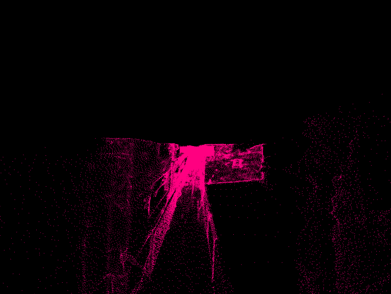
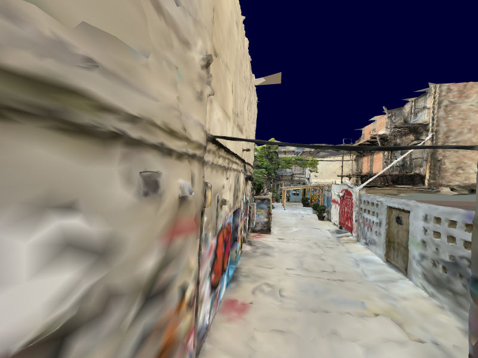

# CG-Ex4
Rendering huge chunks of data, learning about UV coordinates and more.

As the files are too big to upload and reference here, all I can provide
are animated gifs and screenshots of the results.

